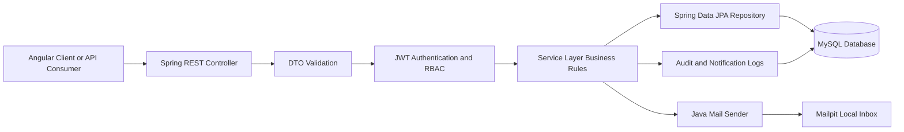
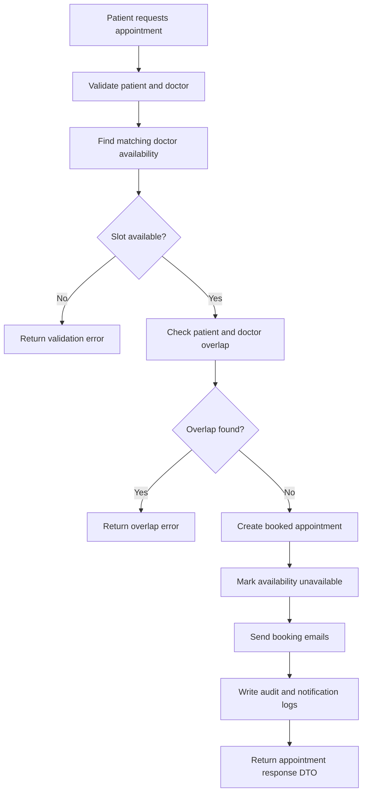
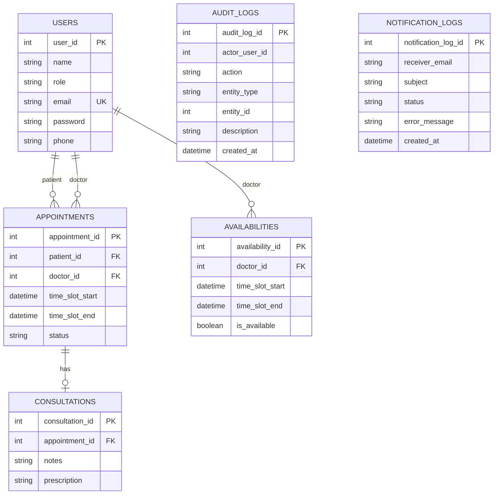

# Smart Healthcare Appointment System

## Overview

The **Smart Healthcare Appointment System** is a full-stack application built to simplify and optimize healthcare appointment management. The backend is built with Spring Boot and focuses on secure user access, appointment scheduling, doctor availability, consultation records, audit logging, notification traceability, and production-style local setup using Docker and Flyway migrations.

## Contents

- [Features](#features)
- [Backend Highlights](#backend-highlights)
- [Tech Stack](#tech-stack)
- [Repository Structure](#repository-structure)
- [Local Backend Setup](#local-backend-setup)
- [Architecture](#architecture)
- [Flow Diagrams](#flow-diagrams)
- [Backend API Endpoints](#backend-api-endpoints)
- [Example API Response](#example-api-response)
- [Database Migrations](#database-migrations)
- [Database Schema](#database-schema)
- [Project Strengths](#project-strengths)
- [Testing](#testing)

---

## Features

- **User Management**:
  - Patients and doctors can register, log in, and manage profiles.
- **Appointment Scheduling**:
  - Patients can book, update, and cancel appointments.
  - Doctor availability is seamlessly integrated.
- **Consultation Records**:
  - Securely store consultation notes, prescriptions, and medical history.
- **Doctor Availability Management**:
  - Doctors can set availability and block unavailable time slots.
- **Notifications**:
  - Automated reminders and updates via email.
  - Notification history tracks sent and failed email attempts.
- **Auditability**:
  - Important user, appointment, and consultation actions are stored in audit logs.
- **API Quality**:
  - DTO-based responses, request validation, pagination, sorting, and consistent error responses.

---

## Backend Highlights

- **Layered Spring Boot API**: Controllers, services, repositories, DTOs, and centralized exception handling keep responsibilities clear.
- **JWT Security and RBAC**: JWT authentication protects APIs, with role-based access for patient and doctor workflows.
- **Scheduling Rules**: Appointment booking, rescheduling, cancellation, overlap prevention, and bulk availability generation are handled in the service layer.
- **Database Reliability**: Flyway manages versioned schema changes for users, appointments, consultations, availabilities, audit logs, and notification logs.
- **Operational Readiness**: Docker Compose starts MySQL, Mailpit, and the backend for local development.
- **Test Coverage**: Unit and MVC tests cover users, validation, security authorization, notification logging, and scheduling rules.
- **Reporting Endpoint**: A lightweight summary API exposes high-level user, appointment, and availability counts.

---

## Tech Stack

- **Programming Language**: Java (JDK 21)
- **Backend Framework**: Spring Boot (`http://localhost:8080`)
- **Frontend Framework**: Angular (v19+) (`http://localhost:4200`)
- **Database**: MySQL
- **Build Tool**: Maven
- **Validation**: Jakarta Validation API
- **Additional Tools**:
  - Lombok for simplifying boilerplate code.
  - Spring Data JPA for database interactions.
  - Java Mail Sender for email notifications.
  - Flyway for versioned database migrations.
  - Springdoc OpenAPI for interactive API documentation.
  - Spring Security for JWT authentication and role-based access control.
  - JUnit, Mockito, and Spring Security Test for backend testing.

---

## Repository Structure

```text
.
├── backend/                 # Spring Boot API
│   ├── src/main/java/       # Controllers, services, repositories, models, DTOs
│   ├── src/main/resources/  # Application config and Flyway migrations
│   └── src/test/java/       # Backend tests
├── frontend/healthcare_app/ # Angular frontend
├── docker-compose.yml       # MySQL, Mailpit, and backend services
└── .env.example             # Local environment template
```

---

## Local Backend Setup

Prerequisites:

- Java 21+
- Maven
- Docker Desktop

Start the backend dependencies and API with Docker:

```bash
cp .env.example .env
docker compose up --build
```

The backend reads configuration from environment variables and applies Flyway migrations from `backend/src/main/resources/db/migration`.

Useful local URLs:

| Tool | URL |
| ---- | --- |
| Backend API | `http://localhost:8080` |
| Swagger UI | `http://localhost:8080/swagger-ui.html` |
| Actuator Health | `http://localhost:8080/actuator/health` |
| Mailpit Inbox | `http://localhost:8025` |
| MySQL | `localhost:3306` |

---

## Architecture

- **Backend**:
  - RESTful API with a layered architecture (Controller → Service → Repository).
  - Business logic is encapsulated within the service layer.
  - Secure user authentication using **JWT (JSON Web Tokens)**.
  - Request/response DTOs prevent exposing internal JPA entities directly.
  - Global exception handling returns consistent API error responses.
- **Database**:
  - MySQL for data persistence.
  - Flyway migrations maintain repeatable schema evolution.
- **Notifications**:
  - CRON jobs integrated for email automation.
  - Email delivery attempts are stored for traceability.
- **Testing**:
  - Focused service and controller tests validate business rules, security rules, and error handling.

---

## Flow Diagrams

### Backend Request Flow



### Appointment Booking Flow



---

## Backend API Endpoints

The backend also exposes interactive API documentation through Swagger UI at `http://localhost:8080/swagger-ui.html`.

### 1. User Management

| Endpoint          | Method | Description                   |
| ----------------- | ------ | ----------------------------- |
| `/users`          | GET    | Fetch all users               |
| `/users/{id}`     | GET    | Fetch user by ID              |
| `/users/register` | POST   | Register a new user           |
| `/users/login`    | POST   | Authenticate an existing user |
| `/users`          | PUT    | Update user profile           |
| `/users/{id}`     | DELETE | Delete user by ID             |

---

### 2. Appointment Scheduling

| Endpoint                      | Method | Description                   |
| ----------------------------- | ------ | ----------------------------- |
| `/appointments`               | GET    | Fetch all appointments        |
| `/appointments/{id}`          | GET    | Fetch appointment by ID       |
| `/appointments`               | POST   | Create a new appointment      |
| `/appointments/cancel/{id}`   | PUT    | Cancel an appointment         |
| `/appointments/complete/{id}` | PUT    | Mark appointment as completed |
| `/appointments/reschedule`    | PUT    | Reschedule an appointment     |
| `/appointments/page`          | GET    | Fetch paginated appointments  |

---

### 3. Consultation Records

| Endpoint              | Method | Description                 |
| --------------------- | ------ | --------------------------- |
| `/consultations`      | GET    | Fetch all consultations     |
| `/consultations/{id}` | GET    | Fetch consultation by ID    |
| `/consultations`      | POST   | Create a new consultation   |
| `/consultations`      | PUT    | Update consultation details |
| `/consultations/{id}` | DELETE | Delete consultation by ID   |

---

### 4. Doctor Availability

| Endpoint                   | Method | Description                    |
| -------------------------- | ------ | ------------------------------ |
| `/availabilities`          | GET    | Fetch all availability records |
| `/availabilities/{id}`     | GET    | Fetch availability by ID       |
| `/availabilities`          | POST   | Add new availability           |
| `/availabilities/generate` | POST   | Generate availability slots    |
| `/availabilities`          | PUT    | Update availability            |
| `/availabilities/{id}`     | DELETE | Remove availability            |

---

### 5. Audit, Notification, and Reports

| Endpoint             | Method | Description                                |
| -------------------- | ------ | ------------------------------------------ |
| `/audit-logs`        | GET    | Fetch audit logs with optional filters     |
| `/notification-logs` | GET    | Fetch email send history with filters      |
| `/reports/summary`   | GET    | Fetch system-level appointment/user counts |

---

## Example API Response

`GET /reports/summary`

```json
{
  "totalUsers": 10,
  "totalPatients": 7,
  "totalDoctors": 3,
  "totalAppointments": 20,
  "bookedAppointments": 8,
  "completedAppointments": 9,
  "cancelledAppointments": 3,
  "totalAvailabilitySlots": 12,
  "availableSlots": 5,
  "unavailableSlots": 7
}
```

Validation and runtime errors follow a consistent response format:

```json
{
  "timestamp": "2026-04-27T00:00:00",
  "error": "Field Validation Error",
  "message": "Request validation failed",
  "statusCode": 400,
  "path": "/users/register",
  "method": "POST",
  "fieldErrors": {
    "email": "Email is invalid"
  }
}
```

---

## Database Migrations

Flyway applies schema changes in order when the backend starts:

| Migration | Purpose |
| --------- | ------- |
| `V1__create_healthcare_schema.sql` | Core users, appointments, consultations, and availability tables |
| `V2__add_scheduling_guards.sql` | Scheduling indexes and availability uniqueness guard |
| `V3__add_audit_logs.sql` | Audit logging table |
| `V4__add_notification_logs.sql` | Notification delivery history table |

---

## Database Schema



---

## Project Strengths

- **Secure Workflows**:
  - JWT authentication and role-based restrictions separate patient and doctor actions.
- **Reliable Scheduling**:
  - Appointment overlap checks and availability generation reduce double-booking risks.
- **Traceable Operations**:
  - Audit logs and notification logs make important backend actions easier to review.
- **Operational Reporting**:
  - Summary reports expose high-level counts for appointments, users, and availability slots.
- **Developer-Friendly Setup**:
  - Docker Compose, Flyway, Swagger UI, and automated tests make the backend easier to run and maintain.

---

## Testing

Run backend tests from the `backend` directory:

```bash
mvn test
```

Current backend test coverage includes service logic, DTO validation, controller behavior, security authorization, notification logging, scheduling rules, and reporting summary calculations.
